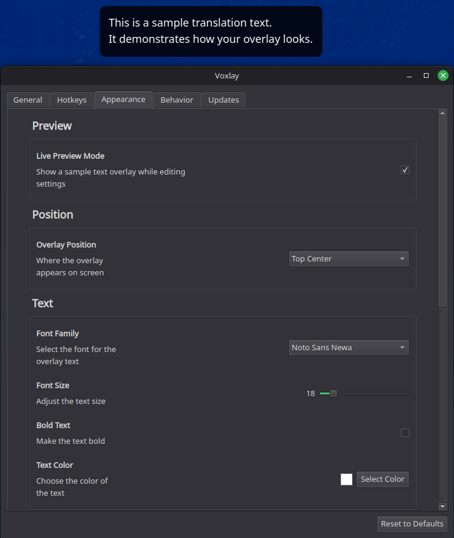

# Voxlay

A minimalist speech to text translation overlay for Linux. Voxlay captures your speech, translates it in real time and displays it as a non intrusive overlay on your screen. Ideally suited for meetings, or daily communication if you dont know the language and want to say something.

## Features

- **Speech Recognition**: Uses speech recognition to capture your voice.
- **Real time Translation**: Translates recognized text using LibreTranslate or CTranslate2 (offline models).
- **Overlay Interface**: Displays translation in a floating click through window that stays on top of other applications.
- **Customizable**: Fully configurable hotkeys, colors, fonts, and overlay positioning.
- **Offline Mode**: Support for offline translation using Helsinki-NLP models via CTranslate2.
- **Multi-platform**: Designed primarily for Linux (X11/Wayland) with architecture allowing for future expansion.

## Screenshots



## Installation

### Linux
1. Run the installation script using curl:
   ```bash
   curl -sSL "https://raw.githubusercontent.com/PawelKawka/Voxlay/main/install.sh" | bash
   ```
2. To launch the app, run:
   ```bash
   voxlay
   ```
   Or find "Voxlay" in your application menu.

#### Removing
To remove the application, run:
```bash
voxlay remove
```

- **API & Engines**

- **Speech Recognition**: `SpeechRecognition` library.
- **Translation**: 
  - **CTranslate2**: (Default) Fast inference engine for Transformer models (supports OPUS-MT models). Runs completely offline.
  - **LibreTranslate**: (Beta) Support for LibreTranslate API. Useful for self-hosted instances.

---

## About
- Developed by Pawel Kawka.
- Open Source and free to use.
